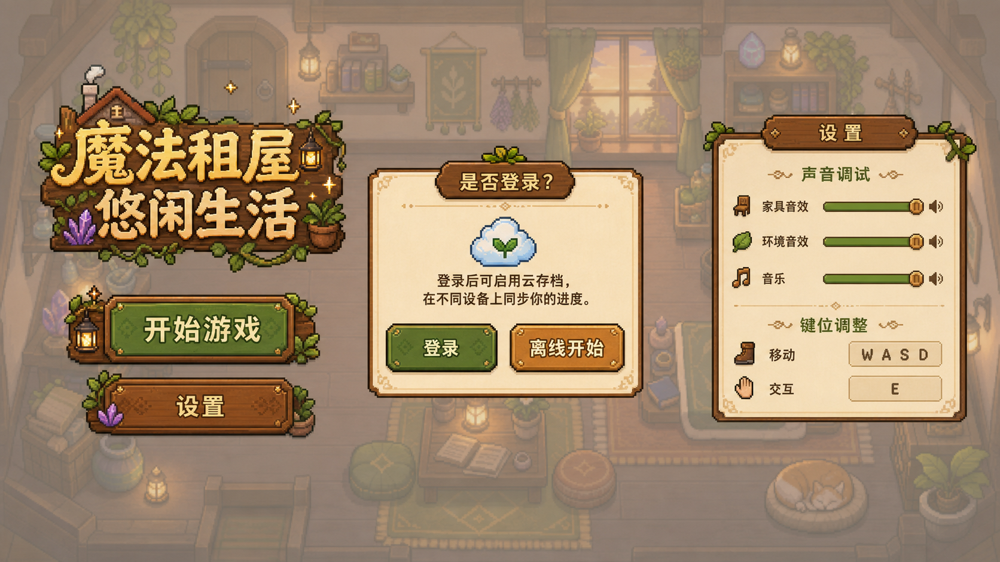

# V0.1 - 游戏标题页

V0.1 的目标是先完成玩家进入游戏前的第一个稳定界面：标题页。它不承载完整玩法，但需要建立游戏气质、基础入口、设置入口和后续登录/存档流程的分叉。

标题页应当先服务于“我愿意点开始进入这个小世界”的感觉，而不是做成复杂的账号大厅。

## 渲染图参考

上图是 Image2 生成的像素风首页 UI 渲染图，只用于表达整体氛围、背景淡化方向和 UI 布局参考。它不是最终实现截图，也不是 UI 文案、按钮状态、面板尺寸、图标或具体美术资源的强制规格；最终实现仍应以本文件和工程验收标准为准。

## 页面目标

- 玩家打开游戏后，第一眼看到游戏标题和温暖的异世界小家氛围。
- 玩家可以选择开始游戏，也可以先进入设置。
- 开始游戏时，玩家能清楚理解登录和游客模式的区别。
- 即使没有账号、没有网络、没有后端服务，本地核心流程也应该可以继续。
- 标题页只处理进入游戏前的选择，不把背包、存档迁移、剧情状态等 gameplay 逻辑塞进标题 UI。

## 第一屏内容

标题页第一屏包含：

- 游戏标题艺术字：`我的异世界小家`。
- 主按钮：`开始游戏`。
- 次按钮：`设置`。
- 可选的小号入口：`继续游戏`，仅当本地或云端存在可继续的存档时显示。
- 可选的小号信息：当前版本号、登录状态或网络状态。

按钮不应直接使用浏览器默认样式，应使用像素风九宫格按钮框。按钮框中间必须干净，方便放置文字；边框不能过厚，不能干扰文字阅读。

## 标题视觉

标题页视觉应该是温暖、安静、轻微魔法感的 top-down 2D 生活游戏氛围。

允许的表现：

- 背景可以是淡化的房间、森林小屋、窗边光、漂浮尘粒、轻微烛光或星点。
- Phaser 可以负责背景动效，例如慢速粒子、光照、云影、像素小装饰。Frontend/src/Hook/usePhaserGame.ts已经有hook了，不要额外创建太多的新架构
- React 负责标题 UI、按钮、设置弹窗和登录提示。

不希望出现：

- 过度发光、过度渐变、模板感强的手游大厅。
- 大量漂浮卡片或复杂营销文案。
- 标题文字和按钮被背景遮挡。
- 按钮中心出现噪点、黑点或纹理导致文字难读。

## 开始游戏流程

点击 `开始游戏` 后，如果玩家未登录，应弹出登录选择。

登录选择包含：

- `登录并同步存档`：使用账号进入，未来可以使用云端存档、跨设备和联机能力。
- `游客开始`：不登录，使用本地存档进入游戏。
- `返回`：关闭选择，回到标题页。

游客模式必须可用。游客模式下不能要求后端、账号或网络服务才能进入本地核心循环。

如果玩家已经登录：

- 有可继续存档时，进入最近一次可用存档。
- 没有存档时，创建新世界或进入新手开场流程。

如果玩家未登录但本地已有游客存档：

- `开始游戏` 可以优先提示继续本地存档。
- 登录同步入口仍然保留，但不能静默覆盖本地存档。

## 设置功能

设置页第一版只做进入游戏前最必要的调试和可访问性配置。

声音设置：

- 主音量。
- 音乐音量。
- 环境音音量。
- 家具/交互音效音量。
- 静音开关。

键位设置：

- 移动。
- 交互。
- 打开设置。

V0.1 的键位设置可以先做展示和默认值确认，不必须完成完整自定义保存。但如果 UI 提供“修改键位”，就必须能完成修改、取消和冲突提示。

设置变更应即时反映在标题页，之后进入游戏时沿用同一份设置。后续正式存档结构确定前，可以先存在本地前端设置中。

## 输入与交互

标题页至少支持：

- 鼠标点击按钮。
- 键盘方向键或 `Tab` 在按钮之间切换焦点。
- `Enter` 或 `Space` 触发当前焦点按钮。
- `Esc` 关闭设置弹窗或登录选择弹窗。

按钮状态至少包含：

- 默认。
- Hover。
- Pressed。
- Disabled。
- Focus visible。

按钮文字需要永远位于按钮视觉中心。不同语言文字长度变化时，按钮可以变宽，但文字不能溢出或被边框压住。

## 多语言

V0.1 至少为标题资产预留中文和日文版本。

- 中文标题：`我的异世界小家`。
- 日文标题：`私の異世界の小さなお家`。

英文/罗马音标题暂不作为 V0.1 必须交付内容。后续如果要做语言切换，应让标题图和按钮文案走同一套 locale 选择，不要在 Phaser Scene 或 React 组件里硬编码所有语言。

## 前端实现边界

建议实现分工：

- `Frontend/src/App.tsx`：挂载标题页或游戏入口。
- `Frontend/src/Game/index.tsx`：挂载 Phaser canvas，使用 `usePhaserGame` 创建和销毁 Phaser 实例。
- `Frontend/src/Game/Features/Scene/GameStart.ts`：标题背景 Scene，只负责背景表现和轻量动效。
- `Frontend/src/Components/GameBtn/`：通用九宫格按钮组件。
- `Frontend/src/Components/TitleScreen/`：标题页 React UI、开始游戏弹窗、设置弹窗。
- `Frontend/src/Assets/title/`：标题艺术字图片。
- `Frontend/src/Assets/ui/`：按钮框、面板框等 UI 图片。

React 和 Phaser 的边界：

- React 负责按钮、弹窗、设置表单、登录选择。
- Phaser 负责可动背景、像素场景、标题页氛围表现。
- 标题页不要直接依赖 gameplay runtime。
- `usePhaserGame` 只负责 Phaser.Game 生命周期，不负责存档、账号、剧情或世界初始化。

## 资产要求

标题图：

- 背景透明。
- 文字清晰。
- 不带多余背景、边框或不可控阴影。
- 中文和日文版本风格应接近。

按钮框：

- 使用九宫格可拉伸方案。
- 中心区域干净，适合叠文字。
- 边框厚度克制。
- 至少包含 normal、hover、pressed 三态。
- 需要记录九宫格切割参数，避免后续使用时靠猜。

## 验收标准

V0.1 完成时应满足：

- 打开前端后能看到完整标题页，而不是空白页。
- 标题图在桌面和移动宽度下都不会被裁切到不可读。
- `开始游戏`、`设置` 两个主入口可点击。
- 未登录点击开始游戏时，会出现登录/游客选择。
- 游客模式不会因为缺少后端服务而被阻塞。
- 设置弹窗可以打开和关闭。
- 声音设置项和键位设置项至少有明确 UI 占位。
- 按钮 hover、pressed、disabled、focus visible 状态可辨认。
- 九宫格按钮拉伸后边角不变形，中心文字不被纹理干扰。
- 标题页没有把 gameplay save、inventory、NPC、地图初始化等逻辑写进 React UI 组件。

## 暂不做

以下内容不属于 V0.1 标题页必须完成范围：

- 完整云存档冲突解决。
- 完整账号中心。
- 完整语言切换系统。
- 完整键位自定义持久化。
- 多存档槽管理。
- 进入游戏后的背包、家具、宠物、剧情、工作台等系统。
- 联机大厅。

## 后续衔接

V0.1 标题页完成后，下一步应进入 V0.2 的游戏架构落地：

- 建立可进入的初始房间 Scene。
- 接入基础移动和交互。
- 建立本地存档最小结构。
- 把登录/游客选择结果传给后续存档加载流程。
